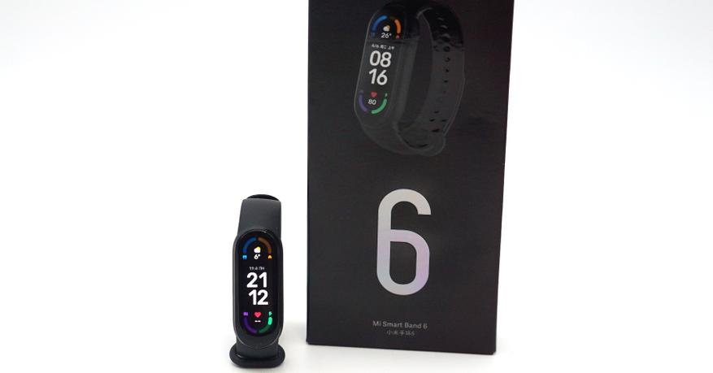
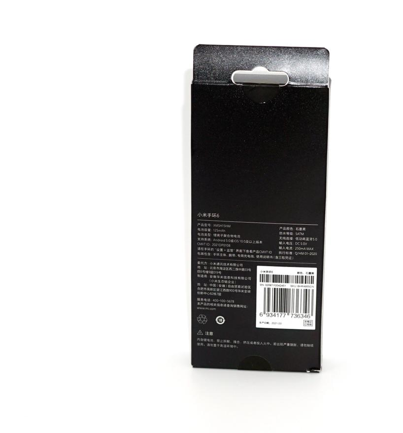
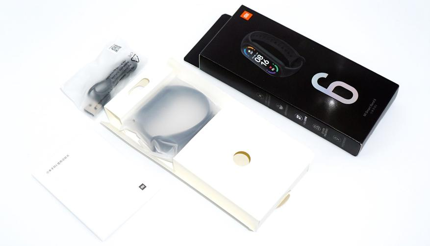

# Review of the new fitness bracelet Xiaomi MiBand 6: amazing screen and amazing functionality

Finally Xiaomi and Huami have done what they couldn't for years. The new generation Xiaomi MiBand is the sixth (6) in a row. The MiBand 6 smart wristband put a high-quality AMOLED screen of oval shape, with narrow margins. There are no physical buttons, which positively affects water resistance. Xiaomi MiBand 6 can track blood oxygen level SpO2, monitor sleep and stress, activity parameters with high accuracy. There are more training modes, there are assistants, such as breathing exercises with cues. Note, the reviewed model has no NFC-module. But there is an automatic recognition of six types of activity. The Russian language is already added "out of the box".

The new long-awaited Xiaomi model was developed, as well as all the previous popular fitness bracelets, in collaboration with Huami. The Xiaomi MiBand 6 fitness bracelet has added modern features and positive developments from other models. And due to the release of the new model, the previous MiBand 5 now sells for almost half the price of the new model.

The Xiaomi MiBand 6 fitness bracelet comes in branded black packaging with a concise design. In the corner is a red "MI" logo. So that buyers are not confused with the previous version, there is a large number "6" on the box, denoting the next generation of popular bracelets. The specific part number can be found in the list on the back: XMSH15HM.

## Watch Specifications:
Brand: Xiaomi/Huami
Model: MiBand (sixth generation)
Item number: XMSH15HM
Case Material: impact-resistant plastic
Water resistance:  5ATM / 50 meters, can swim in the pool
Display: 1.56" AMOLED high resolution 326PPI (348x442 dots)
Glass Protection: Tempered Corning Gorilla Glass 3 + Oleophobic anti-fingerprint coating
Sensors: Next generation optical sensor, 3-axis accelerometer, geomagnetic sensor.
Interfaces: Bluetooth 5.0 LE, magnetic charging (pogo)
Battery life: 14 days in mixed mode, 20 days in economy mode.
Functions: heart rate monitor, pedometer, compass, chronograph, notifications, music playback control, sleep duration and quality, blood oxygen level, stress level and recovery, heart monitoring, absence reminder, change of dial design, PAI personal activity metric, weather forecast indicator, timer, stopwatch, alarm clock.
Sports: 30 programs
Weight: 25 grams (with strap)
Compatibility: Android 5.0 and above, iOS 10.0 and above
Built-in Battery Capacity: 125 mAh

Included with the bracelet comes and branded USB charging, with magnetic attachment, as well as basic instructions. The whole delivery set is packed in individual bags. 

Unlike the previous version, where the elongated case has a rectangular screen, the new model uses a display module with an oval shape. Useful area for displaying information actually increased by 50%.

